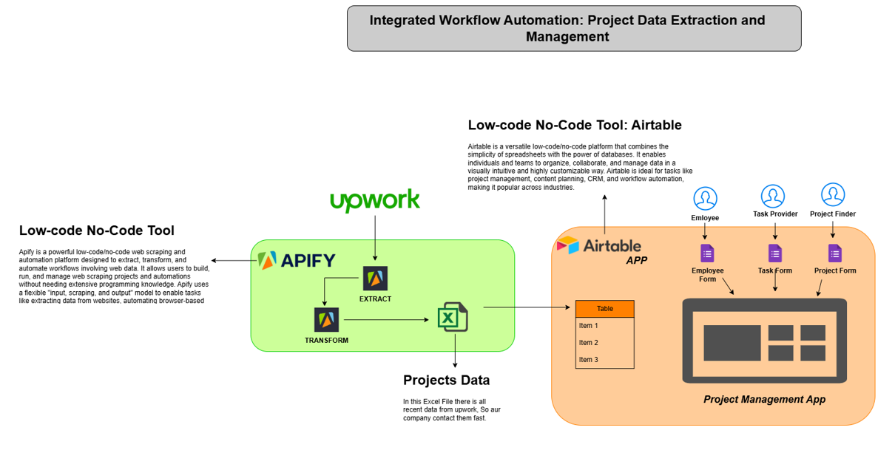

# Integrated Workflow Automation: Project Data Extraction and Management

This project leverages **low-code/no-code tools** to streamline project data extraction and management. It integrates two powerful platforms, **Apify** and **Airtable**, to automate workflows effectively.

---

## Project Diagram

---

## Key Components

### **Apify**
- A low-code/no-code web scraping and automation tool.
- Extracts and transforms project data from platforms like **Upwork**.
- Outputs data in a structured **Excel format**.

### **Airtable**
- A versatile low-code database and workflow management tool.
- Imports and organizes project data into customizable tables.
- Provides intuitive forms for:
  - **Employee management**
  - **Task assignments**
  - **Project tracking**

---

## Workflow

1. **Data Extraction**:  
   Apify scrapes relevant project data from Upwork.

2. **Data Transformation**:  
   The extracted data is cleaned and structured into Excel.

3. **Data Management**:  
   Airtable imports the Excel file for seamless integration into the project management app.

4. **Collaboration**:  
   Teams use Airtable forms to manage employees, tasks, and projects efficiently.

---

## Benefits
- Simplifies tedious data workflows.
- Enables faster outreach to clients.
- Enhances team collaboration through automation.

---

**Let’s automate and simplify project management together!**
