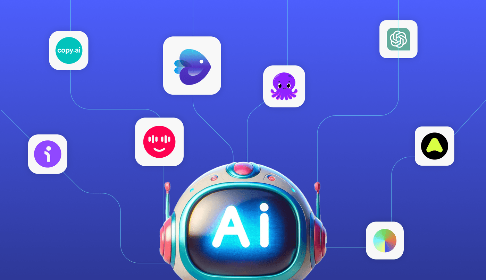

# AI-Powered-DataWorks 🔥🚀



Welcome to **AI-Powered-DataWorks**! 🌐🤖

In this repository, you’ll find a diverse collection of **No-Code/Low-Code AI projects** spanning across various domains, including **Data Engineering**, **Web Development**, **Automation**, and more. 

This repo is designed to showcase how **AI** can be seamlessly integrated into workflows without heavy coding, making it accessible to both developers and non-developers alike. Whether you're building **AI-driven data pipelines**, creating **intelligent chatbots**, or developing **automated websites**, you'll find hands-on projects that demonstrate the power of AI tools working in harmony with **low-code/no-code platforms**. ⚡📊

### 🚀 What’s Inside?

- **AI agents** and **automation workflows** to enhance productivity 💼
- **Data Engineering** projects that leverage AI for data extraction, transformation, and analysis 📈
- **Web applications** that integrate AI to provide intelligent services and solutions 🌍
- **Creative AI tools** for automating design, content creation, and more 🎨

### ⚙️ Tools and Technologies

- **No-Code / Low-Code Platforms**: Bubble, Zapier, Make, Airtable, and more.
- **AI Platforms**: Runway ML, Fireflies, Cursor, and others for building AI-powered solutions.
- **Data Engineering**: Use of tools like Python, Pandas, SQL, and AI integrations for data workflows.

### 💡 Why AI-Powered-DataWorks?

**AI-Powered-DataWorks** is your go-to space for exploring AI’s role in revolutionizing business, technology, and creativity. Whether you’re looking to improve efficiency or build cutting-edge applications, this repo is where AI meets real-world innovation. 

It is a place to experiment, learn, and contribute to the world of AI-powered solutions in a hands-on way. You'll discover real-world applications and get inspired by how AI is transforming different industries. 🌍

### 📚 Getting Started

To get started with the projects in this repository:

1. Clone this repo to your local machine:
    ```bash
    git clone https://github.com/your-username/AI-Powered-DataWorks.git
    ```
2. Explore the individual project directories for more details on how to set up and run them.
3. Check out the **Learning Resources** folder for tutorials and guides related to each project. 📘

### 🛠️ Contributing

We welcome contributions! If you have ideas for new projects or improvements, feel free to fork this repository and open a pull request.

---

Feel free to explore and start building AI-powered solutions across domains with the power of low-code/no-code tools. 🚀💻
