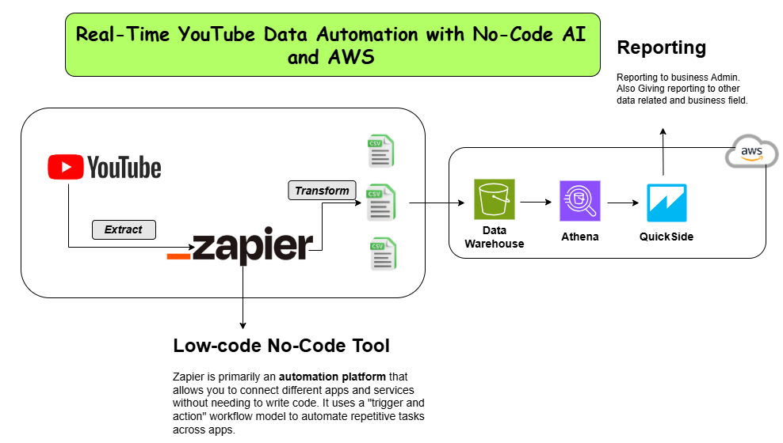

# Real-Time YouTube Data Automation with No-Code AI and AWS

This project demonstrates how to automate the collection and processing of real-time YouTube data using a no-code approach with Zapier and AWS.

## Components

- **Zapier**: A no-code automation platform that triggers workflows based on YouTube events.
- **AWS**: Used for storing, processing, and analyzing YouTube data. Specific services may include:
  - **Amazon S3**: For storing raw YouTube data.
  - **AWS Lambda**: For processing YouTube data.
  - **Amazon Athena**: For querying and analyzing YouTube data.
- **YouTube Data API**: Used to retrieve real-time data from YouTube.

## Workflow

1. **Trigger**: A new video is uploaded to a YouTube channel.
2. **Zapier**: Detects the new video upload event and triggers a workflow.
3. **Data Extraction**: The Zapier workflow uses the YouTube Data API to extract relevant data, such as:
   - Title
   - Description
   - View count
4. **Data Transformation (Optional)**: 
   - AWS Lambda can transform the extracted data into a desired format for further analysis.
5. **Data Storage**: 
   - Transformed data is stored in Amazon S3 for persistence.
6. **Data Analysis (Optional)**:
   - Amazon Athena can be used to query and analyze the data stored in S3.

## Benefits

- **Real-time Automation**: Automates the data collection and processing workflow, eliminating manual intervention.
- **No-code Approach**: Simplifies setup and management with Zapier's no-code interface.
- **Scalability**: AWS services ensure scalability for increasing data volumes.

## Additional Notes

- This is a high-level overview; specific implementation details will vary based on your needs.
- You will need:
  - A **Zapier account** to configure a Zap connecting YouTube and AWS.
  - AWS services such as **S3**, **Lambda**, and **Athena** to be set up and configured.

---
